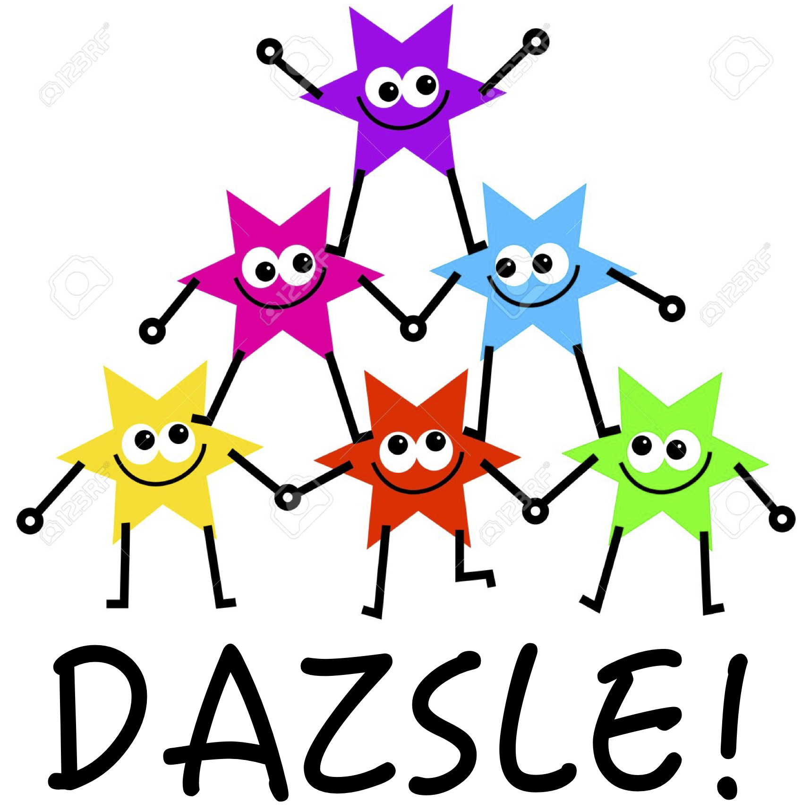

# Introduction

This is a landing page for CMS DAZSLE analyses based at the Fermilab LHC Physics Center (LPC). DAZSLE stands for "Dijet pseudoscalar(a)/Z'/Scalar Low-mass Effort." We're interested in using jet substructure, machine learning, and data-driven background estimation techniques to fully explore the CMS data.

* Our code repositories are described in [Code Repositories](CODE.md) 
* Some public conference talks are in [Public Talks](TALKS.md) 
* Published papers and preliminary results are in [Public Papers](PAPERS.md) 
* Links to our internal meetings and indico agendas are in [Internal Meetings](INDICO.md) 
* Links to our internal documenation are in [Internal Documentation](CADI.md) 
* Our private Slack server is in [Communication and Slack](SLACK.md)